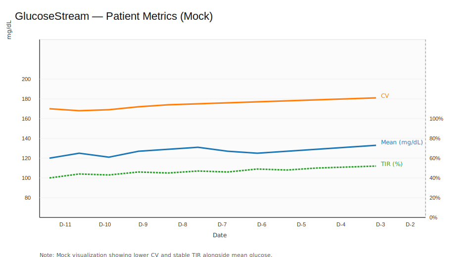
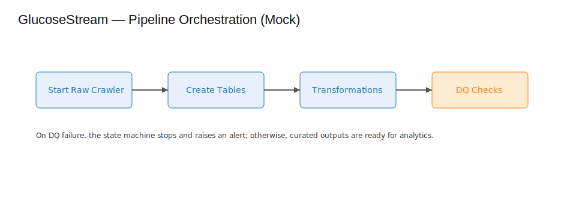

<div align="center">
  <h1>🩺 GlucoseStream</h1>
  <p>Serverless AWS Data Lake & ETL/ELT for Glucose Analytics</p>
</div>

<div align="center">

[](https://github.com/chaffybird56/GlucoseStream/actions)
[](LICENSE)


</div>

---

## 📋 Overview

GlucoseStream is a production‑minded, serverless analytics platform for processing continuous glucose monitoring (CGM) data—similar to data from devices like Dexcom or Freestyle Libre. The system ingests timestamped glucose readings, stores them in Amazon S3, catalogs with AWS Glue, transforms and queries with Amazon Athena, orchestrates with AWS Step Functions and Lambda, and visualizes insights through either Amazon QuickSight or a lightweight Flask dashboard.

### 🎯 Why This Matters

**For Healthcare:** Provides actionable, privacy‑aware insights for patients and clinicians to track blood sugar trends, identify risky patterns, and optimize diabetes management.

**For Engineers:** Demonstrates industry‑grade patterns including Infrastructure as Code (Terraform), streaming ingestion, ELT via Athena, data quality gates, cost controls, CI/CD, and extensible analytics (SQL + Lambda + optional Scala Spark).

## ✨ Key Features

<table>
<tr>
<td width="50%">

**🔄 Data Pipeline**
- Ingest glucose events via Go Lambda
- Catalog with AWS Glue
- Transform with Athena SQL
- Orchestrate with Step Functions

</td>
<td width="50%">

**📊 Analytics & Visualization**
- Compute patient metrics
- Flask dashboard with charts
- Differential privacy support
- QuickSight integration

</td>
</tr>
</table>

## 🛠️ Tech Stack

**Languages & Frameworks:** Go 1.22+, Python 3.10+, SQL (Athena)

**AWS Services:** S3, Glue, Athena, Step Functions, Lambda, IAM

**Infrastructure:** Terraform, GitHub Actions

## 📖 Table of Contents

- [📋 Overview](#-overview)
- [✨ Key Features](#-key-features)
- [🛠️ Tech Stack](#️-tech-stack)
- [📷 Screenshots & Interpretation](#-screenshots--interpretation)
- [🚀 Quickstart](#-quickstart)
- [🧪 Tests](#-tests)
- [🏗️ Data Model & ERD](#️-data-model--erd)
- [🔒 Security & Compliance](#-security--compliance)
- [💰 Cost Notes](#-cost-notes)
- [👨‍💻 Local Development](#️-local-development)
- [📜 License](#-license)

## 📷 Screenshots & Interpretation

### Patient Dashboard View



**How to Read the Charts (For Non-Medical Readers):**

- **Mean Glucose** (blue line): Average blood sugar level over time. A stable range around 80–140 mg/dL is considered healthy for most people.

- **Time in Range (TIR)** (green dashed line): Percentage of time your blood sugar stays between 70–180 mg/dL. Higher = better control. Aim for **>70%** for most people.

- **Coefficient of Variation (CV)** (orange line): Measures how much your blood sugar swings. Lower = more stable. Aim for **<36%**.

- **Glucose Management Indicator (GMI)** (estimated A1c): Predicts what your hemoglobin A1c would be. Lower = better long-term control.

### Pipeline Orchestration



The data pipeline runs automatically: **Glue crawler** → **Athena table creation** → **transformations** → **data quality checks**. If any step fails, the pipeline stops to prevent bad data from being published.

## 📂 Repository Layout

```
GlucoseStream/
  terraform/          # Infrastructure as Code
  lambdas/            # Go Lambda functions
    ingest-go/        # Ingestion handler
    dq-check-go/      # Data quality checker
  data-generator/     # Sample data generator
  analytics/sql/      # Athena SQL transformations
  flask-dashboard/    # Visualization app
  docs/               # Documentation
  .github/workflows/  # CI/CD
```

## 🚀 Quickstart

### Quick Demo (Recommended First Step)

**Try the system without AWS setup:**

```bash
./scripts/quick_demo.sh
```

This script will:
- ✅ Generate sample glucose data (24 hours for patient 'p1')
- ✅ Show data statistics and preview
- ✅ Provide instructions for running the Flask dashboard
- ✅ Display key metrics (Time in Range, average glucose, etc.)

**What you'll see:**
- Sample glucose events in JSONL format
- Data statistics (range, average, Time in Range %)
- Instructions for viewing the dashboard

### Full Setup (AWS Infrastructure)

### Prerequisites

- AWS account with credentials configured (`aws configure`)
- Terraform >= 1.5 installed
- Go 1.22+ installed
- Python 3.10+ installed

### Step 1: Bootstrap AWS Resources

```bash
make build-lambdas
cd terraform
terraform init
terraform apply -auto-approve
```

**What this does:** Creates S3 buckets (raw/curated/results), Glue database + crawler, Athena workgroup, Step Functions state machine, and Lambda functions.

### Step 2: Generate Sample Data

```bash
cd data-generator
go run ./... -patient p1 -minutes 1440 -out sample_events.jsonl
```

**Or use the quick demo script:**
```bash
./scripts/quick_demo.sh
```

**What this does:** Creates realistic glucose readings (1 day of data at 1-minute intervals) for testing.

### Step 3: Run the Pipeline

Start the Step Functions state machine from the AWS Console to crawl, transform, and compute metrics.

### Step 4: Explore Your Data

**Option A: Flask Dashboard**

```bash
cd flask-dashboard
python -m venv .venv && source .venv/bin/activate
pip install -r requirements.txt
FLASK_APP=app.py flask run
```

Then visit `http://localhost:5000` and enter a patient ID (e.g., `p1`).

**Option B: Amazon QuickSight**

Point QuickSight to the Athena curated/metrics tables created by SQL in `analytics/sql`.

## 🧪 Tests

Run the test suite:

```bash
make test
```

**What this verifies:**
- Data generator produces physiologically realistic glucose patterns
- Flask routes render correctly
- All components integrate properly

**Sample Output:**

```bash
=== RUN   TestCircadianBaseReasonableRange
--- PASS: TestCircadianBaseReasonableRange (0.00s)
=== RUN   TestCircadianBaseSmoothness
--- PASS: TestCircadianBaseSmoothness (0.00s)
PASS
ok  	glucosestream/data-generator	0.15s

..                                                                       [100%]
2 passed in 0.34s
```

## 🏗️ Data Model & ERD

See [docs/ERD.md](docs/ERD.md) for the Entity-Relationship Diagram showing how patients, devices, glucose events, sessions, metrics, and alerts relate to each other.

## 🔒 Security & Compliance

- ✅ **Encryption:** All S3 buckets use server-side encryption
- ✅ **Least Privilege:** IAM roles grant minimal permissions
- ✅ **No PII:** Raw events exclude personally identifiable information
- ✅ **Differential Privacy:** Noise injection available for shared metrics

## 💰 Cost Notes

- **S3:** ~$5/month for reasonable data volumes
- **Athena:** ~$10/month for moderate query usage
- **Glue:** On-demand runs cost pennies
- **Lambda:** Nearly free for small workloads

See [docs/COSTS.md](docs/COSTS.md) for optimization tips.

## 👨‍💻 Local Development

**Requirements:**
- Go 1.22+
- Python 3.10+
- AWS CLI configured

**Makefile Commands:**

```bash
make build-lambdas  # Build Go Lambda binaries
make test          # Run test suite
make clean         # Clean build artifacts
```

## 📜 License

This project is licensed under the **MIT License** - see the [LICENSE](LICENSE) file for details.